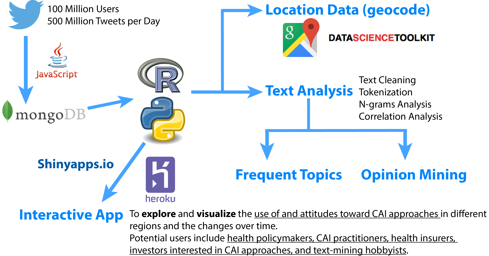

```{r, echo=FALSE}
## Set global and markdown global options
knitr::opts_chunk$set(
    cache       = FALSE,     
    fig.width   = 14,       
    fig.height  = 5,       
    fig.align   = 'center',   
    echo        = FALSE,    
    message     = FALSE,     
    strip.white = TRUE,     
    warning     = FALSE)    

save.scipen <- getOption("scipen") 
options(scipen = 10)        
```

## Motivation

* Chronic diseases cause [70% of all deaths worldwide](http://www.who.int/ncds/introduction/en/) and [88% deaths in USA](http://www.who.int/nmh/countries/usa_en.pdf?ua=1). 
* Conventional medicine can treat the symptoms but not cure a chronic disease; treating people with chronic diseases account for [86% of health care costs in US](http://www.cdc.gov/chronicdisease/overview/).
* Healthcare reform from disease control to preventative and personalized care.
* Strategic plans of [World Health Organization (WHO)](http://www.who.int/medicines/publications/traditional/trm_strategy14_23/en/) and [US government](https://nccih.nih.gov/about/ataglance) to integrate orthodox medicine with alternative approaches to health and wellness. 
* [33% American adults](https://nccih.nih.gov/research/statistics/NHIS/2012/key-findings) use complementary, alternative, and integrative (CAI) approaches to health and wellness. 
* **Prompt analysis of real-time real-world use of and attitudes toward CAI approaches can help decision-making in healthcare reform and determining potential market value of CAI approaches.** 
* **Try my [App](https://zw-einstein.shinyapps.io/ShinyMap/)!**

--- 

## Twitter Provides Real-time Real-world Insights
    


---

## CAI Uses Reflected by Tweets on April 21, 2016

* Tweets were collected for April 10-29, 2016, using [60 search keywords](https://github.com/zweinstein/D_I/blob/gh-pages/keywords.txt) defined based on [examples given by the White House](http://www.whccamp.hhs.gov/fr2.html).
* Nutrition, yoga, massage, and meditation are the 4 most frequently tweeted CAI approaches. 
* When those keywords are disabled, ayurveda, hypnosis, and acupuncture appear to be the top approaches. Other top approaches include reiki, homeopathy, herbal medicine, tai chi.

```{r}
require(RColorBrewer)
load("data/gram0421.Rdata")
par(mfrow=c(1,2))
plot(gram1, max.words=160, random.order=F, # min.freq=60,
     colors = brewer.pal(6, "Dark2"), scale = c(4, 0.4))
plot(gram2, max.words=80, random.order=F, # min.freq=60,
     colors = brewer.pal(6, "Dark2"), scale = c(3, 0.3))
```

---

## CAI Approaches Are Used Everywhere in the World

English tweets about <span style="color:red"> Ayurveda </span>,
<span style="color:green"> Hypnosis </span>, and 
<span style="color:blue"> Acupuncture </span> in the World.

```{r, fig.height=6.5}
require(maps)
require(ggplot2)
HypLoc <- readRDS('data/HypUserLocations0421.rda')
AcupLoc <- readRDS('data/AcupUserLocations0421.rda')
AyurLoc <- readRDS('data/AyurUserLocations0421.rda')
worldMap <- map_data("world") 
zp1 <- ggplot(worldMap)
zp1 <- zp1 + geom_path(aes(x = long, y = lat, group = group),  # Draw map
                       colour = gray(2/3), lwd = 1/3)
zp1 <- zp1 + geom_point(data = AyurLoc,  # Add points indicating users
                        aes(x = longitude, y = latitude),
                        colour = "red", alpha = 1/3, size = 0.5) +
  geom_point(data = HypLoc,  # Add points indicating users
             aes(x = longitude, y = latitude),
             colour = "darkgreen", alpha = 1/3, size = 0.5) +
  geom_point(data = AcupLoc,  # Add points indicating users
             aes(x = longitude, y = latitude),
             colour = "blue", alpha = 1/3, size = 0.5) 
zp1 <- zp1 + coord_equal()  
zp1 <- zp1 + theme_minimal()  # Drop background annotations
zp1 <- zp1 + xlab("longitude") + ylab("latitude") + 
  ggtitle("English Tweets about Alternative Therapies on April 21, 2016") 
  
print(zp1)
```

---

## CAI Approaches Are Used Everywhere in USA

English tweets about <span style="color:red"> Ayurveda </span>,
<span style="color:green"> Hypnosis </span>, and 
<span style="color:blue"> Acupuncture </span> in USA.

```{r, fig.height=6.5}
require(ggplot2)
HypLoc_usa <- readRDS('data/HypUserLocatUSA0421.rda')
AcupLoc_usa <- readRDS('data/AcupUserLocatUSA0421.rda')
AyurLoc_usa <- readRDS('data/AyurUserLocatUSA0421.rda')
usaMap <- map_data("state")
zp2 <- ggplot(usaMap) 
zp2 <- zp2 + geom_path(aes(x = long, y = lat, group = group),  # Draw map
                       colour = gray(2/3), lwd = 1/3)
zp2 <- zp2 + geom_point(data = AyurLoc_usa,  # Add points indicating users
                        aes(x = longitude, y = latitude),
                        colour = "red", alpha = 1/3, size = 1) +
  geom_point(data = HypLoc_usa,  # Add points indicating users
             aes(x = longitude, y = latitude),
             colour = "darkgreen", alpha = 1/3, size = 1) +
  geom_point(data = AcupLoc_usa,  # Add points indicating users
             aes(x = longitude, y = latitude),
             colour = "blue", alpha = 1/3, size = 1) 
zp2 <- zp2 + coord_equal()  
zp2 <- zp2 + theme_minimal()  # Drop background annotations
zp2 <- zp2 + xlab("longitude") + ylab("latitude") + 
  scale_x_continuous(limits = c(-125, -65)) +
  scale_y_continuous(limits = c(23, 50)) +
  ggtitle("English Tweets about Alternative Therapies in the Contiguous 48 States on April 21, 2016")

print(zp2)
```

---

## Acupuncture: What for? How? Opinions?

English Tweets about Acupuncture during April 10-29, 2016:
* People use acupuncture for weight loss, back pain, hot flash, breast cancer...
* People use various types of acupuncture including needle, massage, cupping, moxibustion, and electro-acupuncture.
* Positive opinions indicated by "can help", "great", "like", "relax"...

```{r, fig.align='center'}
gram1acup <- readRDS('data/gram1acup.rda')
gram2acup <- readRDS('data/gram2acup.rda')
par(mfrow=c(1,2))
plot(gram1acup, max.words=160, random.order=F, # min.freq=60,
     colors = brewer.pal(6, "Dark2"), scale = c(4, 0.4))
plot(gram2acup, max.words=80, random.order=F, # min.freq=60,
     colors = brewer.pal(6, "Dark2"), scale = c(3, 0.3))
```

---

## Overall Positive Feelings About CAI and Acupuncture

* Sentiment score based on [NRC Word-Emotion Association Lexicon](http://saifmohammad.com/WebPages/NRC-Emotion-Lexicon.htm). 
* Mixed feelings, overall positive... 

```{r, fig.height=3}
require(ggplot2)
load("data/st.dataframe_acup.Rdata")
st.all <- readRDS('data/stAll0421.rda')
par(mfrow=c(2,1))
ggplot(st.all, aes(sentiment, count)) +
        geom_bar(stat = "identity", aes(fill = sentiment)) +
        theme(legend.position = "none", axis.text=element_text(size=8),
              axis.title=element_text(size=9,face="bold"),
              title=element_text(size=9,face="bold")) +
        xlab("") + ylab("Total Count") + 
        ggtitle("Total Sentiment Score for Tweets about CAI Approaches April 21, 2016")
ggplot(st, aes(sentiment, count)) +
        geom_bar(stat = "identity", aes(fill = sentiment)) +
        theme(legend.position = "none", axis.text=element_text(size=8),
              axis.title=element_text(size=9,face="bold"),
              title=element_text(size=9,face="bold")) +
        xlab("") + ylab("Total Count") + 
        ggtitle("Sentiment Score for Tweets about Acupuncture April 10-29, 2016")
```

---

## Conclusions and Future Work
* People are tweeting about CAI approaches all over the world and in USA.
* Top CAI approaches are nutrition, yoga, massage, meditation, ayurveda, hypnosis, acupuncture, reiki, homeopathy, herbal medicine, and tai chi.
 - People use acupuncture for weight loss, pain relief, hot flash, breast cancer.
 - People use needle, massage, cupping, moxibustion, and electro-acupuncture methods.
* Some of my discoveries agree with the two most recent National Health Survey Data in [2007](https://nccih.nih.gov/research/statistics/2007/camsurvey_fs1.htm#health) and [2012](https://nccih.nih.gov/research/statistics/NHIS/2012/key-findings), but the twitter analysis is real time.
* Future work:
 - Conduct the topic mining for other CAI approaches;
 - Explore different methods for opinion mining.
 - Deploy an [App on ShinyApps.io](https://zw-einstein.shinyapps.io/ShinyMap/) or Heroku.
