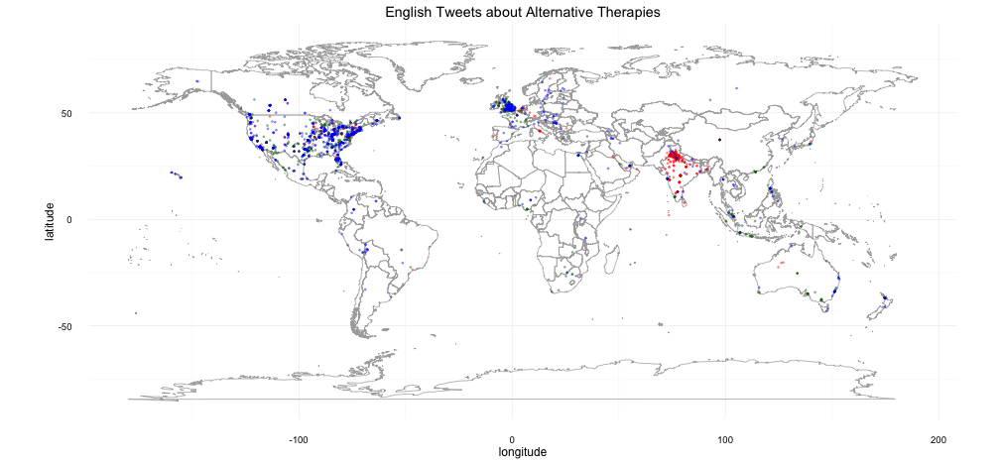
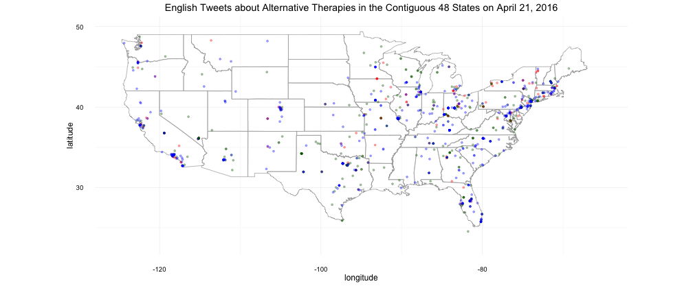
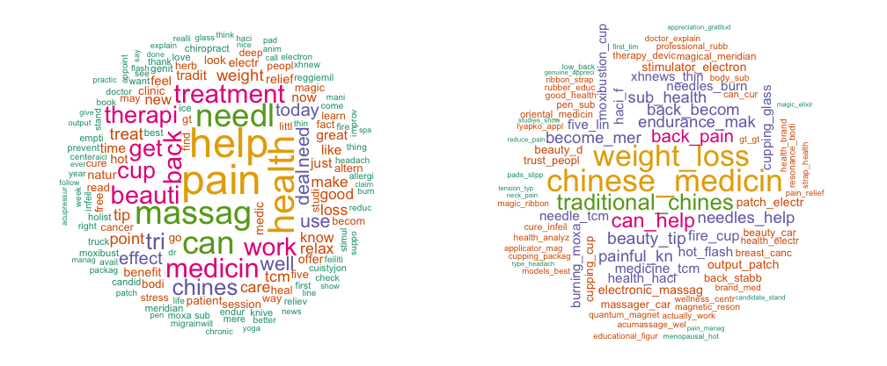
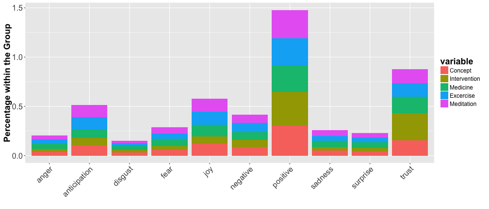
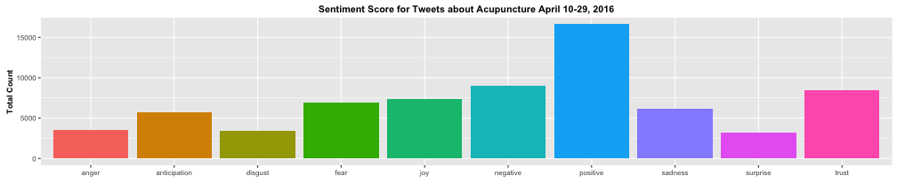

## Motivation

* Chronic diseases cause [70% of all deaths worldwide](http://www.who.int/ncds/introduction/en/) and [88% deaths in USA](http://www.who.int/nmh/countries/usa_en.pdf?ua=1). 
* Conventional medicine can treat the symptoms but not cure a chronic disease; treating people with chronic diseases account for [86% of health care costs in US](http://www.cdc.gov/chronicdisease/overview/).
* Healthcare reform from disease control to preventative and personalized care.
* Strategic plans of [World Health Organization (WHO)](http://www.who.int/medicines/publications/traditional/trm_strategy14_23/en/) and [US government](https://nccih.nih.gov/about/ataglance) to integrate orthodox medicine with alternative approaches to health and wellness. 
* [33% American adults](https://nccih.nih.gov/research/statistics/NHIS/2012/key-findings) use complementary, alternative, and integrative (CAI) approaches to health and wellness. 
* **Prompt analysis of real-time real-world use of and attitudes toward CAI approaches can help decision-making in healthcare reform and determining potential market value of CAI approaches.** 

--- 

## Twitter Provides Real-time Real-world Insights
    

---

## CAI Uses Reflected by Tweets on April 21, 2016

* 70 search keywords were defined based on [examples given by the White House](http://www.whccamp.hhs.gov/fr2.html).
* Nutrition, yoga, massage, and meditation are the 4 most frequently tweeted CAI approaches. 
* When those keywords are disabled, ayurveda, hypnosis, and acupuncture appear to be the top approaches.
* Other top approaches include reiki, homeopathy, herbal medicine, tai chi.

---

## CAI Approaches Are Used Everywhere in the World

---

## CAI Approaches Are Used throughout USA

---

## What do people use Acupuncture for? How do they use it? What do they think about it?

* People use acupuncture for weight loss, back pain, hot flash, breast cancer.
* People use various types of acupuncture including needle, massage, cupping, moxibustion, and electro-acupuncture.
* Positive opinions as indicated by "can help", "great", "like", "magic"...

---

## Overall Positive Feelings About CAI and Acupuncture

* Sentiment score based on [NRC Word-Emotion Association Lexicon](http://saifmohammad.com/WebPages/NRC-Emotion-Lexicon.htm). 
* Mixed feelings, overall positive... 
* Deeper text mining can identify more specific contexts for the positive and negative sentiment, respectively. 

---

## Conclusions and Future Work
* People are tweeting about CAI approaches all over the world, and throughout USA.
* Acupuncture is among the most commonly used CAI approach:
 - People use acupuncture for weight loss, pain relief, hot flash, breast cancer.
 - People use various types of acupuncture including needle, massage, cupping, moxibust, and electronic acupuncture.
* Some of my discoveries agree with the two most recent National Health Survey Data in [2007](https://nccih.nih.gov/research/statistics/2007/camsurvey_fs1.htm#health) and [2012](https://nccih.nih.gov/research/statistics/NHIS/2012/key-findings), but the twitter analysis is real time.
* Future work:
 - Conduct the topic mining for other CAI approaches;
 - Try more robust method for sentiment analysis.
 - Deploy an App on ShinyApps.io or Heroku.
