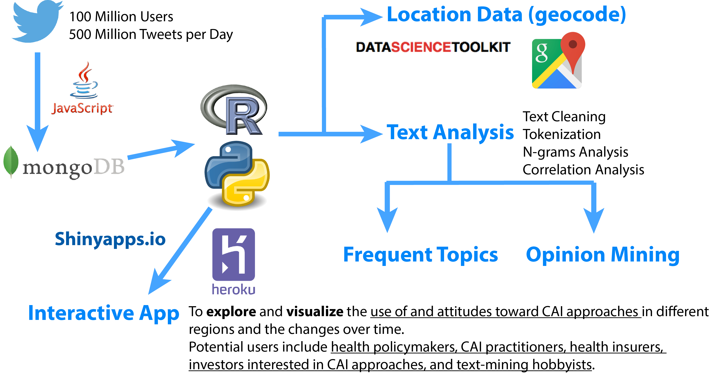

## Motivation

* Chronic diseases cause [70% of all deaths worldwide](http://www.who.int/ncds/introduction/en/) and [88% deaths in USA](http://www.who.int/nmh/countries/usa_en.pdf?ua=1). 
* Conventional medicine can treat the symptoms but not cure a chronic disease; treating people with chronic diseases account for [86% of health care costs in US](http://www.cdc.gov/chronicdisease/overview/).
* Healthcare reform from disease control to preventative and personalized care.
* Strategic plans of [World Health Organization (WHO)](http://www.who.int/medicines/publications/traditional/trm_strategy14_23/en/) and [US government](https://nccih.nih.gov/about/ataglance) to integrate orthodox medicine with alternative approaches to health and wellness. 
* [33% American adults](https://nccih.nih.gov/research/statistics/NHIS/2012/key-findings) use complementary, alternative, and integrative (CAI) approaches to health and wellness. 
* **Prompt analysis of real-time real-world use of and attitudes toward CAI approaches can help decision-making in healthcare reform and determining potential market value of CAI approaches.** 
* **Try my [ShinyTwitter](https://zw-einstein.shinyapps.io/ShinyTwitter/) and [ShinyMap](https://zw-einstein.shinyapps.io/ShinyMap/) Apps!**

--- 

## Twitter Provides Real-time Real-world Insights
    

---

## Tweets about Major CAI Approaches

* I have performed natural language processing on tweets collected through the Twitter Search API from April to July, 2016, using [60 search keywords](https://github.com/zweinstein/D_I/blob/gh-pages/keywords.txt) defined based on [examples given by the White House](http://www.whccamp.hhs.gov/fr2.html).
* Nutrition, yoga, massage, and meditation are the 4 most frequently tweeted CAI approaches. 
* Other top approaches include ayurveda, hypnosis, acupuncture, reiki, homeopathy, herbal medicine, tai chi.

---

## Tweets about CAI Approaches: Everywhere in the World

English tweets about  Ayurveda ,
 Hypnosis , and 
 Acupuncture  in the World.

---

## Tweets about CAI Approaches: Everywhere in USA

English tweets about  Ayurveda ,
 Hypnosis , and 
 Acupuncture  in USA.

---

## Acupuncture: What for? How? Opinions?

English Tweets about Acupuncture during April 10-29, 2016:
* People use acupuncture for weight loss, back pain, hot flash, breast cancer...
* People use various types of acupuncture including needle, massage, cupping, moxibustion, and electro-acupuncture.
* Positive opinions indicated by "can help", "great", "like", "relax"...

---

## Favorite Type(s) of CAI Approaches?

* Sentiment score based on [NRC Word-Emotion Association Lexicon](http://saifmohammad.com/WebPages/NRC-Emotion-Lexicon.htm). 
* CAI approaches were classified into [5 different groups](https://zw-einstein.shinyapps.io/ShinyTwitter/). Therapeutic interventions (no oral intake) show the larger positive v.s. negative ratio than other approaches.

---

## Conclusions and Future Work
* People are tweeting about CAI approaches all over the world and in USA.
* Top CAI approaches are nutrition, yoga, massage, meditation, ayurveda, hypnosis, acupuncture, reiki, homeopathy, herbal medicine, and tai chi.
 - People use acupuncture for weight loss, pain relief, hot flash, breast cancer.
 - People use needle, massage, cupping, moxibustion, and electro-acupuncture methods.
* Some of my discoveries agree with the two most recent National Health Survey Data in [2007](https://nccih.nih.gov/research/statistics/2007/camsurvey_fs1.htm#health) and [2012](https://nccih.nih.gov/research/statistics/NHIS/2012/key-findings), but the twitter analysis is real time.
* Future work:
 - Noise reduction in natural language processing of collected tweets;
 - Explore different methods for opinion mining.
 - Deploy an [App on ShinyApps.io](https://zw-einstein.shinyapps.io/ShinyMap/) or Heroku.
